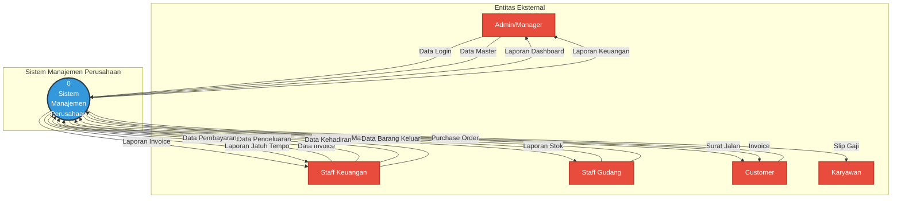

# Data Flow Diagram (DFD) Level 0
## Sistem Manajemen Perusahaan PT. CAM JAYA ABADI

### Context Diagram (DFD Level 0)

---

## Penjelasan Entitas Eksternal

### 1. **Admin/Manager**
   - **Input:** Data login, data master (produk, kendaraan, customer, karyawan)
   - **Output:** Laporan dashboard, laporan keuangan lengkap
   - **Fungsi:** Mengelola sistem dan melihat semua laporan

### 2. **Staff Keuangan**
   - **Input:** Data invoice, data pembayaran, data pengeluaran, data kehadiran karyawan
   - **Output:** Laporan invoice, laporan jatuh tempo, slip gaji
   - **Fungsi:** Mengelola keuangan dan penggajian

### 3. **Staff Gudang**
   - **Input:** Data barang masuk, data barang keluar
   - **Output:** Laporan stok produk
   - **Fungsi:** Mengelola inventori/stok barang

### 4. **Customer**
   - **Input:** Purchase Order (PO)
   - **Output:** Surat jalan, invoice
   - **Fungsi:** Melakukan pemesanan dan menerima dokumen

### 5. **Karyawan**
   - **Input:** -
   - **Output:** Slip gaji bulanan
   - **Fungsi:** Menerima informasi gaji

---

## Aliran Data Utama

| Dari | Ke | Data | Keterangan |
|------|-----|------|------------|
| Admin | Sistem | Data Master | Input produk, kendaraan, customer, karyawan |
| Staff Keuangan | Sistem | Data Invoice | Input tagihan customer |
| Staff Keuangan | Sistem | Data Pengeluaran | Input expenses perusahaan |
| Staff Keuangan | Sistem | Data Kehadiran | Input kehadiran untuk gaji |
| Staff Gudang | Sistem | Data Barang Masuk | Input stok masuk |
| Staff Gudang | Sistem | Data Barang Keluar | Input stok keluar |
| Customer | Sistem | Purchase Order | Order dari customer |
| Sistem | Admin | Laporan Dashboard | Grafik dan statistik |
| Sistem | Staff Keuangan | Laporan Invoice | Daftar invoice dan jatuh tempo |
| Sistem | Staff Gudang | Laporan Stok | Laporan stok produk |
| Sistem | Customer | Surat Jalan & Invoice | Dokumen pengiriman dan tagihan |
| Sistem | Karyawan | Slip Gaji | Rincian gaji bulanan |

---

**Status:** ✅ DFD Level 0 (Context Diagram) selesai  
**Selanjutnya:** DFD Level 1 (detail per proses)
