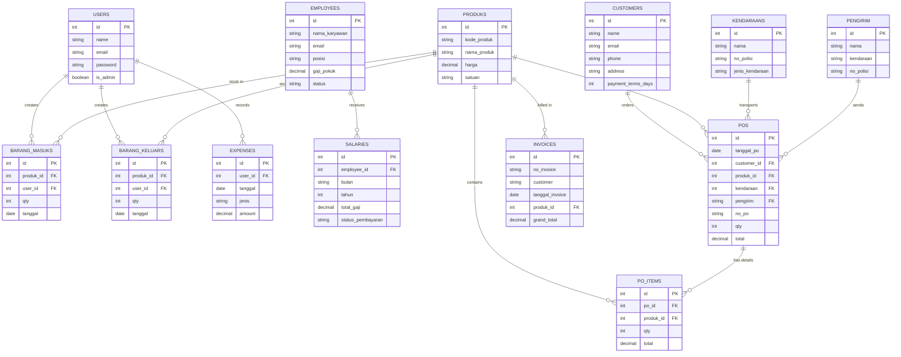

# Entity Relationship Diagram (ERD)
## Sistem Manajemen Perusahaan PT. CAM JAYA ABADI

### Diagram Relasi Database

---

### Penjelasan Singkat

**Tabel Utama:**
- **Users** - User login sistem (admin & user biasa)
- **Employees** - Data karyawan perusahaan
- **Customers** - Data customer/pelanggan
- **Produks** - Master data produk
- **Kendaraans** - Data kendaraan untuk pengiriman
- **Pengirim** - Data pengirim barang

**Tabel Transaksi:**
- **POS** - Purchase Orders (pesanan)
- **PO_Items** - Detail item per PO
- **Invoices** - Faktur/invoice
- **Salaries** - Gaji karyawan
- **Barang Masuks** - Stok masuk
- **Barang Keluars** - Stok keluar
- **Expenses** - Pengeluaran perusahaan

**Relasi Utama:**
- 1 Customer → banyak PO
- 1 PO → banyak PO Items
- 1 Produk → dipakai di banyak transaksi
- 1 Employee → terima banyak Salary records
- Users mencatat Barang Masuk/Keluar dan Expenses
